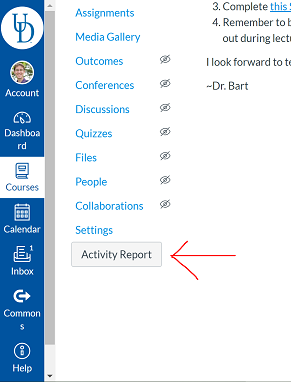

A sophisticated collection of web utilities that augment the Instructure Canvas site. None of these tools are officially created or maintained by Instructure, they're just helpful bits of functionality that I wanted.

Use at your own risk. I'll try to make it obvious if there's any dangerous functionality, but in general this is just tools for accessing data more conveniently.

This is the "Next Generation" version of the toolkit. The `canvas-web-utils` was the old one, not as good as this!

# Browser Support

I develop on Chrome. I make no claims that it will work on anything else. It probably does work in FireFox though.

# Installation

1. Install [TamperMonkey extension](https://chrome.google.com/webstore/detail/tampermonkey/dhdgffkkebhmkfjojejmpbldmpobfkfo?hl=en) for Chrome.
2. Visit the install link for the [Canvas-Web-Utils userscript](https://github.com/UD-CIS-Teaching/canvas-web-utils/raw/master/dist/canvas-web-utils.user.js).
3. You should be prompted to install the extension, which you should do.

## Activity Report

The Activity Report allows you to check each student and TA for recent activity. In particular, it shows you students' recent and total submitted assignments, and staff's recent and total graded assignments. This can help you identify students who are not engaging, and TAs who are not staying on top of their duties.

1. Visit the course you would like to generate a report for (e.g., go to the course's front page).
2. Click the "Activity Report" button at the bottom of the left-hand Course Navigation menu.

3. The Activity Report dialog box appears.

4. You can edit the date/time shown in the "Completed since" box to adjust the threshold for "recent" activity. The default value is one week prior to today. The format of the date/time string is `YYYY-MM-DDTHH:MM:SS.000Z`. The `T` and `Z` are literal characters, and the `.000` represent partial seconds. For values less than 10, include the `0`.

5. Click the "Download and Build Report" button to generate the report. This process might take a while, but intermediate results are shown.

6. Once the report is fully loaded, you can view the student's activity at the top. You can click on any of the column headers to sort the table by that header (click once for ascending, twice for descending).
      * The **Submitted Recently** column shows the number of assignments that were submitted after the datetime in the "Completed since" box.
      * The **Total Unsubmitted** shows how many published assignments this student is still responsible for. 

7. The "Staff Grading" report is at the bottom. The system treats anyone with the "Instructor" and "TA" roles as staff members. This table cannot be resorted.
      * The **Graded Recently** column shows the number of assignments had a grade entered by that staff member after the datetime in the "Completed since" box.
  
      * The **Graded Total** shows how many published assignments this staff member has entered a grade for. 

## Limit Section Enrollment

Greg Silber made this!

A new button is available in the Peoples tab, that lets you limit the enrollment for all students to their own section. This is a FERPA compliance thing - you either know you need it or you don't need it.

## Spread Grade

In the Speed Grader, a new button is available next to the grade entry box to "Spread Grade". This is for Word Doc assignments that were meant to be submitted by a single student representing a group. The word doc will be parsed for any email addresses. Then, those email addresses will be shown to the grader in a new dialog, and then can choose to "spread" the grade over to those other students (if they are found in the course). Note that the submission is NOT copied, mostly just for FERPA reasons.

In theory, a comment should be left on the students' assignment that the grade was transferred, but that may or may not be working. Canvas is confusing.

