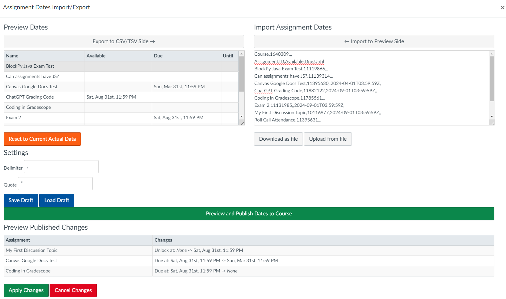

A sophisticated collection of web utilities that augment the Instructure Canvas site. None of these tools are officially created or maintained by Instructure, they're just helpful bits of functionality that I wanted.

Use at your own risk. I'll try to make it obvious if there's any dangerous functionality, but in general this is just tools for accessing data more conveniently.

This is the "Next Generation" version of the toolkit. The `canvas-web-utils` was the old one, not as good as this!


# Browser Support

I develop on Chrome. I make no claims that it will work on anything else. It probably does work in FireFox though.

# Installation

1. Install [TamperMonkey extension](https://chrome.google.com/webstore/detail/tampermonkey/dhdgffkkebhmkfjojejmpbldmpobfkfo?hl=en) for Chrome.
2. Visit the install link for the [More Canvas Tools userscript](https://ud-cis-teaching.github.io/more-canvas-tools/more-canvas-tools.user.js).
3. You should be prompted to install the extension, which you should do.

# Features

We are always working on new features, but here's what we have so far:

1. [Activity Report](#activity-report): To quickly check recent completion data by students and TAs.
2. [Limit Section](#limit-section-enrollment): For FERPA compliance.
3. [Spread Grade](#spread-grade): A particular tool for the speedgrader that replicates grades to other group members (based on email addresses found in the submitted Word document). Mostly only for courses that use Word Documents.
4. [List Ungraded Submissions](#list-ungraded-submissions): A tool to list all ungraded submissions in a course.
5. [List Recently Enrolled Users](#list-recently-enrolled-users): A tool to list all users who have recently enrolled in a course.

## Activity Report

The Activity Report allows you to check each student and TA for recent activity. In particular, it shows you students' recent and total submitted assignments, and staff's recent and total graded assignments. This can help you identify students who are not engaging, and TAs who are not staying on top of their duties.

1. Visit the course you would like to generate a report for (e.g., go to the course's front page).
2. Click the "Activity Report" button at the bottom of the left-hand Course Navigation menu.


3. The Activity Report dialog box appears.


4. You can edit the date/time shown in the "Completed since" box to adjust the threshold for "recent" activity. The default value is one week prior to today. The format of the date/time string is `YYYY-MM-DDTHH:MM:SS.000Z`. The `T` and `Z` are literal characters, and the `.000` represent partial seconds. For values less than 10, include the `0`.

5. Click the "Download and Build Report" button to generate the report. This process might take a while, but intermediate results are shown.


6. Once the report is fully loaded, you can view the student's activity at the top. You can click on any of the column headers to sort the table by that header (click once for ascending, twice for descending).
      * The **Submitted Recently** column shows the number of assignments that were submitted after the datetime in the "Completed since" box.
      * The **Total Unsubmitted** shows how many published assignments this student is still responsible for. 

7. The "Staff Grading" report is at the bottom. The system treats anyone with the "Instructor" and "TA" roles as staff members. This table cannot be resorted.
      * The **Graded Recently** column shows the number of assignments had a grade entered by that staff member after the datetime in the "Completed since" box.
  
      * The **Graded Total** shows how many published assignments this staff member has entered a grade for. 

## Limit Section Enrollment

Greg Silber made this!

A new button is available in the Peoples tab, that lets you limit the enrollment for all students to their own section. This is a FERPA compliance thing - you either know you need it or you don't need it.

## Spread Grade

In the Speed Grader, a new button is available next to the grade entry box to "Spread Grade". This is for Word Doc assignments that were meant to be submitted by a single student representing a group. The word doc will be parsed for any email addresses. Then, those email addresses will be shown to the grader in a new dialog, and then can choose to "spread" the grade over to those other students (if they are found in the course). Note that the submission is NOT copied, mostly just for FERPA reasons.

In theory, a comment should be left on the students' assignment that the grade was transferred, but that may or may not be working. Canvas is confusing.


## List Ungraded Submissions

A new button is available in the Assignments tab that lets you list all ungraded submissions in the course. This is useful for quickly identifying assignments that need to be graded.

## List Recently Enrolled Users

On the front page of your course, a box will appear on the right hand side that lists all users who have recently enrolled in the course. This is useful for quickly identifying new students who may need special attention. You can adjust the threshold for "recent" enrollment in the settings (leave it blank to get all users).

Users who have been added in the past three days will be marked red and users who have been added in the past five days will be marked yellow.

If you click on a user, it will take you to their User page, which has a link to their grades and submissions.

## Search

**SORRY THIS IS NOT DONE YET.**

This is a super rough prototype of a search feature. It's not very good yet, but it's a start. You can click `Search` from the global navigation menu on the left, and then use
the dialog to search across any assignment type.

## Import/Export Assignment Dates



On the Assignments page, you can now import and export assignment dates in bulk. This is useful for quickly copying assignment dates from one course to another.

Access this menu by clicking the triple dot menu button in the top-right of the Assignments page, then choosing the "Import/Export Assignment Dates" option.


the "Export to CSV/TSV Side" button will take the current contents of the preview below it and load them into the textarea on the right. Correspondingly, the "Import to Preview Side" button will take the contents of the textarea and load them into the preview on the other side. You can either edit the textarea directly, or use the "Upload from file" button to load a CSV or TSV file from your computer. You can also "Download as file" to save the contents of the textarea to a file.

The format of the CSV/TSV file is as follows:

```csv
Course,1234
Assignment,ID,Available,Due,Lock
First Assignment,12345,2024-09-01T03:59:59Z,2024-09-01T03:59:59Z,2024-09-01T03:59:59Z
Second Assignment,67890,2024-09-01T03:59:59Z,,
```

You can actually have more than one course in the file, in which case only the currently active course will be read.

```csv
Course,,1234,,,5678,,
Assignment,ID,Available,Due,Lock,Available,Due,Lock
First Assignment,12345,2024-09-01T03:59:59Z,,,2024-09-01T03:59:59Z,,
```

You can adjust the delimiter and quote for how the file is generated, but that should not affect the parser; I believe it will intelligently handle either CSV or TSV files, but I have not confirmed this.

The `Save Draft` and `Load Draft` buttons allow you to store/restore the current version of the **PREVIEW AREA** (not the textarea) in your localStorage. This is useful for saving your work in progress, if you need to come back to it later.

Finally, the `Preview and Publish Dates to Course` button will take the contents of the preview area and check how they will be applied to this course. It will show you a list of assignments that will be updated, and then you can click the `Apply Changes` button to actually apply the changes. This will update the assignments in the course with the new dates. Or you can click `Cancel Changes` to go back to editing the dates.

## Development Environment Installation

If you want to develop on this project, you'll need to do the following:

1. Clone this repository:

```bash
git clone https://github.com/UD-CIS-Teaching/more-canvas-tools.git
```

2. Install the dependencies:

```bash
npm install
```

3. Start the development server:

```bash
npm watch
```

4. Follow steps 1-4 of the Setup instructions to load the development version of the script into your browser: <https://stackoverflow.com/a/55568568/1718155>

Here's an example of what my header looks like, note the `@require` line:

```js
// ==UserScript==
// @name         Dev More Canvas Tools
// @version      0.2.1.2024.7.22.12.10
// @description  Next generation canvas tools for simplifying your life
// @author       Austin Cory Bart
// @match        *://*.instructure.com/*
// @namespace    udcis.canvas
// @run-at       document-start
// @grant        none
// @updateURL    https://ud-cis-teaching.github.io/more-canvas-tools/more-canvas-tools.user.js
// @downloadURL  https://ud-cis-teaching.github.io/more-canvas-tools/more-canvas-tools.user.js
// @require      file://C:/Users/acbar/Projects/ud-cis-repo/more-canvas-tools/dist/more-canvas-tools.user.js
// ==/UserScript==
```

# Change Log

* 0.1.3: Fixed bug with grades not being copied correctly with Spread Grade feature
* 0.2.0: Spread Grade now copies the grade AND rubric, and also has an interface for copying comments.
* 0.2.1: Fix spread grade to allow spreading grades different than the rubric
* 0.3.0: Add feature for listing ungraded submissions
* 0.4.0: New feature for listing recently enrolled users on course page. Also super rough prototype of search command.